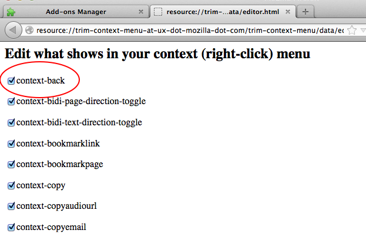

Trim Context Menu
=====================

This Firefox Addon helps tame your right-click (context) menu.

To edit which elements are visible:

* `resource://trim-context-menu-at-ux-dot-mozilla-dot-com/trim-context-menu/data/editor.html`

OR (long path)

* navigate to `about:addons`
* choose this addon
* under preferences, `lauch addon`
* edit to your hearts content!

